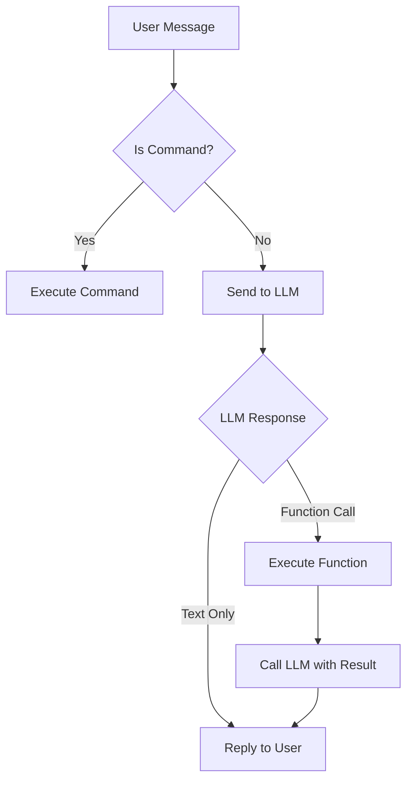

# Implementation Plan: Conversational LLM with Database Access & Exa Search

## Overview
Enhance the Telegram bot with a conversational LLM that can:
1. **Query the database** - Answer questions about monitored URLs, events, telemetry
2. **Search the web** - Use Exa search API for finding new sauna/spa sites
3. **Natural conversations** - Understand context and provide helpful responses

## Architecture

### 1. Function Calling System
The LLM will have access to "tools" (functions) it can call to fetch data:

```javascript
// Available tools for LLM
const AVAILABLE_TOOLS = [
  {
    name: "query_database",
    description: "Query the D1 database for events, URLs, or statistics",
    parameters: {
      query_type: "events|urls|stats",
      filters: {...}
    }
  },
  {
    name: "search_exa",
    description: "Search the web using Exa for sauna/spa related sites",
    parameters: {
      query: "string",
      num_results: "number"
    }
  },
  {
    name: "get_url_details",
    description: "Get detailed information about a specific monitored URL",
    parameters: {
      url_id: "number"
    }
  }
];
```

### 2. Conversation Flow



## Implementation Steps

### Phase 1: Database Query Functions

#### 1.1 Create Query Service
**File:** `src/services/conversation.js`

Functions to implement:
- `queryEvents(filters)` - Fetch events (future/past/all)
- `queryUrls(filters)` - Fetch monitored URLs
- `getStats()` - Return telemetry/statistics
- `getUrlDetails(urlId)` - Get full info for a URL

#### 1.2 LLM Prompt with Function Calling
**File:** `src/lib/prompts.js`

```javascript
export const PROMPT_CONVERSATION = `
You are SaunaScopeBot, a helpful assistant for monitoring sauna and spa websites.

You have access to the following tools:
1. query_database - Query events, URLs, or statistics
2. search_exa - Search the web for sauna/spa sites
3. get_url_details - Get details about a specific URL

When a user asks a question, determine if you need to call a tool to answer it.
If yes, respond with a function call. If no, respond directly.

Current date: {{DATE}}
User language preference: {{LANGUAGE}}
`;
```

### Phase 2: Exa Search Integration

#### 2.1 Research: MCP in Cloudflare Workers
**Challenge:** MCP (Model Context Protocol) is designed for desktop environments, not serverless.

**Solution Options:**
1. **Direct Exa API Integration** (Recommended)
   - Use Exa's HTTP API directly from the worker
   - No MCP needed - simpler and more reliable
   - Cost: ~$5/month for 1000 searches

2. **MCP Proxy** (Complex)
   - Run MCP server elsewhere (e.g., Railway, Fly.io)
   - Worker calls proxy via HTTP
   - Less reliable, more moving parts

**Recommendation:** Use Exa API directly.

#### 2.2 Implement Exa Search
**File:** `src/services/exa.js`

```javascript
export class ExaService {
  constructor(apiKey) {
    this.apiKey = apiKey;
    this.baseUrl = 'https://api.exa.ai/search';
  }

  async search(query, options = {}) {
    const response = await fetch(this.baseUrl, {
      method: 'POST',
      headers: {
        'Content-Type': 'application/json',
        'x-api-key': this.apiKey
      },
      body: JSON.stringify({
        query,
        num_results: options.num_results || 10,
        type: 'neural', // or 'keyword'
        category: 'company' // For finding sauna/spa businesses
      })
    });
    
    return await response.json();
  }
}
```

### Phase 3: Conversational Router

#### 3.1 Update Router
**File:** `src/router.js`

```javascript
// In handleTelegramMessage, after command checks:
} else {
  // Natural language query
  await this.handleConversation(chatId, text);
}

async handleConversation(chatId, text) {
  const conversationService = new ConversationService(
    this.env,
    this.db,
    new ExaService(this.env.EXA_API_KEY)
  );
  
  const response = await conversationService.chat(text);
  await this.sendTelegram(chatId, response);
}
```

#### 3.2 Conversation Service
**File:** `src/services/conversation.js`

```javascript
export class ConversationService {
  async chat(userMessage) {
    // 1. Send message to LLM with available tools
    const llmResponse = await this.callLLM(userMessage);
    
    // 2. Check if LLM wants to use a tool
    if (llmResponse.function_call) {
      const toolResult = await this.executeTool(llmResponse.function_call);
      
      // 3. Send tool result back to LLM for final answer
      const finalResponse = await this.callLLM(userMessage, toolResult);
      return finalResponse.text;
    }
    
    // 4. Return direct answer
    return llmResponse.text;
  }
  
  async executeTool(functionCall) {
    switch (functionCall.name) {
      case 'query_database':
        return await this.queryDatabase(functionCall.parameters);
      case 'search_exa':
        return await this.exa.search(functionCall.parameters.query);
      case 'get_url_details':
        return await this.db.getUrlById(functionCall.parameters.url_id);
      default:
        throw new Error(`Unknown tool: ${functionCall.name}`);
    }
  }
}
```

## User Review Required

> [!IMPORTANT]
> **Exa API vs MCP Decision**
> - **Recommended:** Direct Exa API integration (simpler, more reliable)
> - **Alternative:** MCP proxy (complex, requires external server)
> 
> Please confirm which approach you prefer.

> [!WARNING]
> **Cost Implications**
> - Exa API: ~$5/month for 1000 searches
> - Gemini API calls will increase with conversational features
> 
> Estimated monthly cost: $10-20 depending on usage

## Example Conversations

**User:** "Show me all upcoming sauna events in London"
```
Bot thinks: Need to query database for events
→ Calls query_database({type: 'events', filters: {location: 'London'}})
→ Returns: 2 events found
Bot: "I found 2 upcoming sauna events in London:
1. Community Sauna Baths - October 17, 2025
2. Banya No 1 - TBA"
```

**User:** "Find me new Nordic spa websites"
```
Bot thinks: Need to search web
→ Calls search_exa({query: 'Nordic spa sauna Finland Sweden'})
→ Returns: List of URLs
Bot: "I found 5 Nordic spa websites:
1. saunafin.com - Finnish Traditional Sauna
2. nordicwellness.se - Swedish Spa Chain
..."
```

## Verification Plan

### Test Cases
1. **Database Queries**
   - "How many URLs am I monitoring?"
   - "Show me future events"
   - "What's the status of saunologia.fi?"

2. **Exa Search**
   - "Find new sauna websites in Germany"
   - "Search for spa resorts in Iceland"

3. **Mixed Conversations**
   - "I'm planning a trip to Finland, find me spas and check if I'm already monitoring them"

### Success Criteria
- [ ] LLM correctly identifies when to use tools
- [ ] Database queries return accurate results
- [ ] Exa search finds relevant sites
- [ ] Responses are in user's preferred language
- [ ] No infinite loops or errors
